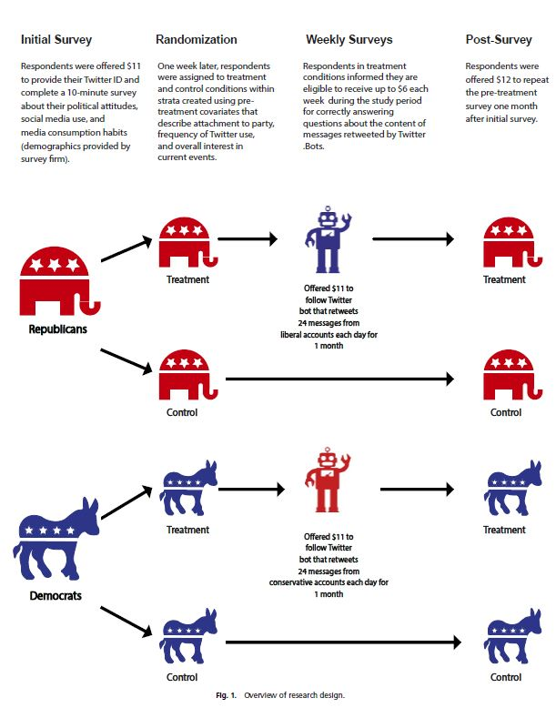
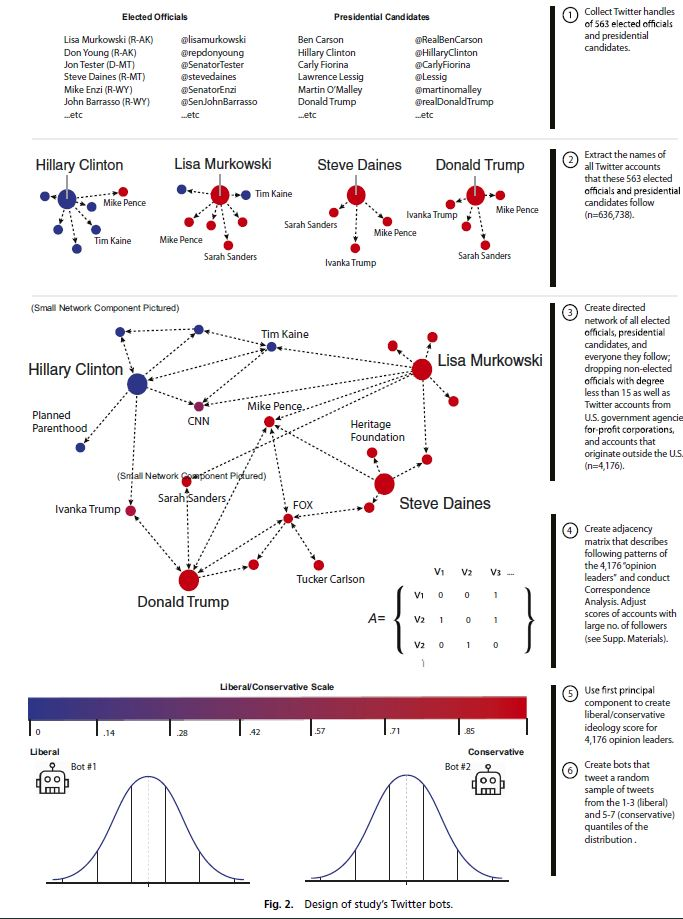
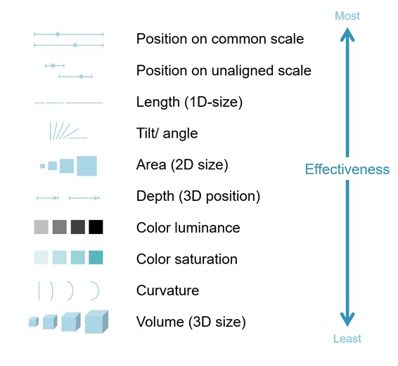
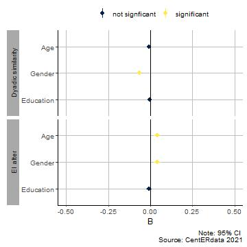
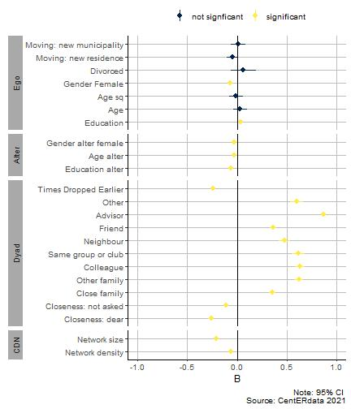

```{r setup, include=FALSE}
knitr::opts_chunk$set(echo = F, cache = T, message = F, warning = F)
```

background-image: url(ru_en_kleur.jpg)
background-size: 20%
background-position: 95% 5%
## Visualizing data

<br>

What is a data visualization?

--

A way of transforming data into something that is perceivable by the human mind.

--

.pull-left[We can define data in a **broad** or **narrow** way.]

--

.pull-right[
Examples:
1. Figure or graph
2. Visual of theoretical model or process
3. Visual abstract (even a video)]

---
background-image: url(ru_en_kleur.jpg)
background-size: 20%
background-position: 95% 5%
## Visualizing data


.pull-left[

]

--

.pull-right[

]


---
background-image: url(ru_en_kleur.jpg)
background-size: 20%
background-position: 95% 5%
## Visualizing data

<br>

Why do we need data visualizations?

--

1. Communicate knowledge and research more effectively
--

2. Visual aid to clarify your story
--

3. Attract a bigger and broader audience for your research
--

4. Career prospects (publications and grants)


---
background-image: url(ru_en_kleur.jpg)
background-size: 20%
background-position: 95% 5%
## Data visualization = storytelling

.pull-left[Things to keep in mind when writing your blog:
- What is my story?
- Who is my audience?
- What is my goal?]

--

.pull-right[Not so different for creating (data)visuals:
- Message
- Informative
- Goal
]
--


---
background-image: url(ru_en_kleur.jpg)
background-size: 20%
background-position: 95% 5%
## Preattentive attributes of visual perception


.font30[source: https://help.tableau.com/current/blueprint/en-us/bp_why_visual_analytics.htm]


---
background-image: url(ru_en_kleur.jpg)
background-size: 20%
background-position: 95% 5%
## Preattentive attributes of visual perception



.font30[source: https://www.statstories.com]


---
background-image: url(ru_en_kleur.jpg)
background-size: 20%
background-position: 95% 5%
class: middle, center
# Types of data visualizations with the WVS data


```{r data prep}
#DW2
#create a plot file for DW2
library(tidyverse)
library(haven)
library(countrycode)
library(hrbrthemes)
library(viridis)

#
wvs_aggregated <- read_sav(file = "data/data-raw/WVS_files/wvs_aggregated_postmat.sav")

#keep distinct records
wvs_agg_unique <- wvs_aggregated %>%
  distinct()

cy_selection <- wvs_agg_unique %>% 
  select(postmat_cy, S020, S002, S003) %>%
  distinct() %>%
  mutate(country = countrycode(S003, origin = "iso3n", destination = "country.name"))


```


---
background-image: url(ru_en_kleur.jpg)
background-size: 20%
background-position: 95% 5%
## Comparisons
```{r comparison 1, fig.retina=3, fig.align='center'}
cy_selection %>%
  filter(S002 == 3) %>%
  mutate(country_fac = as.factor(country),
         country_fac = fct_reorder(.f = country_fac, .x = postmat_cy)) %>%
  filter(country_fac != "Colombia") %>%
  ggplot(aes(x = country_fac, y = postmat_cy)) +
  geom_col() +
  labs(x = "Country", y = "Postmaterialism score", title = "Postmaterialism score by country \n (1994-1998)") +
  theme_ipsum() +
  theme(axis.text.x = element_text(angle = 90))

```

---
background-image: url(ru_en_kleur.jpg)
background-size: 20%
background-position: 95% 5%
## Comparisons: Rotate the damn plot!

```{r comparison 2, fig.retina=3, fig.align='center'}
cy_selection %>%
  filter(S002 == 3) %>%
  mutate(country_fac = as.factor(country),
         country_fac = fct_reorder(.f = country_fac, .x = postmat_cy),
         label = paste0(round(postmat_cy,2), "%"), hjust = 3.5) %>%
  filter(country_fac != "Colombia") %>%
  ggplot(aes(y = country_fac, x = postmat_cy)) +
  geom_col() +
  #geom_text(aes(label = label), size = 3, colour = "red")
  labs(y = "Country", x = "Postmaterialism score", title = "Postmaterialism score by country \n (1994-1998)") +
  theme_ipsum()

```

---
background-image: url(ru_en_kleur.jpg)
background-size: 20%
background-position: 95% 5%
## Comparisons

```{r comparison 3, fig.retina=3, fig.align='center'}
cy_selection %>%
  filter(S002 == 3) %>%
  mutate(country_fac = as.factor(country),
         country_fac = fct_reorder(.f = country_fac, .x = postmat_cy),
         label = paste0(round(postmat_cy,2), "%"), hjust = 3.5) %>%
  filter(country_fac != "Colombia") %>%
  ggplot(aes(y = country_fac, x = postmat_cy, fill = postmat_cy)) +
  geom_col() +
  #geom_text(aes(label = label), size = 3, colour = "red")
  scale_fill_viridis(alpha = 0.6) +
  labs(y = "Country", x = "Postmaterialism score", title = "Postmaterialism score by country \n (1994-1998)",
       fill = "Score") +
  theme_ipsum() + 
  theme(legend.position = "right")

```

---
background-image: url(ru_en_kleur.jpg)
background-size: 20%
background-position: 95% 5%
## Comparisons

```{r comparison 4, fig.retina=3, fig.align='center'}
cy_selection %>%
  ggplot(aes(y = postmat_cy, x = as.factor(S002), fill = as.factor(S002))) +
  geom_boxplot() +
  scale_fill_viridis(discrete = T, alpha = 0.6) +
  geom_jitter(size = 0.4, alpha = 0.9) +
  #geom_text(aes(label = label), size = 3, colour = "red")
  labs(x = "WVS round", y = "Postmaterialism score", title = "Postmaterialism score by WVS round") +
  theme_ipsum() +
  theme(legend.position = "none")

```

---
background-image: url(ru_en_kleur.jpg)
background-size: 20%
background-position: 95% 5%
## Trends
```{r trends 1, fig.retina=3, fig.align='center'}
cy_selection %>%
  ggplot(aes(y = postmat_cy, x = S020)) +
  geom_smooth(colour = "black") +
  geom_point(size = 0.6) +
  #geom_text(aes(label = label), size = 3, colour = "red")
  labs(x = "Time", y = "Postmaterialism score", title = "Trend in Mean Postmaterialism Score") +
  theme_ipsum()

```

---
background-image: url(ru_en_kleur.jpg)
background-size: 20%
background-position: 95% 5%
## Presenting statistical models


---
background-image: url(ru_en_kleur.jpg)
background-size: 20%
background-position: 95% 5%
## Presenting statistical models

.pull-left[]

--

.pull-right[]


---
background-image: url(ru_en_kleur.jpg)
background-size: 20%
background-position: 95% 5%
## Data types

Of course there are many different chart types out there!

--

Take a look at:
- https://datavizproject.com/
- https://datavizcatalogue.com/

--

Explore different options and play around with the data.

--

But remember: keep your story and audience in mind!


---
background-image: url(ru_en_kleur.jpg)
background-size: 20%
background-position: 95% 5%
## Important tips

1. Readable labels 
--

2. Data to ink ratio
--

3. Colour blindness
--

4. Careful use of colours
--

5. Always visualize error and uncertainty

---
background-image: url(ru_en_kleur.jpg)
background-size: 20%
background-position: 95% 5%
## Now it's your turn

Step 1: **Think!** Formulate a clear story for your blog and think quickly about visual aids you can use. (figure or a visual)

--

Step 2: **Explore!** Get inspired by charts and visuals that other authors have used:

Look at the data page of the [NYT](https://www.nytimes.com/column/whats-going-on-in-this-graph) for inspiration and also the [SDG](https://datatopics.worldbank.org/sdgatlas/) atlas from the worldbank.

--

Step 3: **Sketch!** Get out your notepads and sketch different chart types for the same information.

--

Step 4: **Create!** Use a software program to create the chart you decided. All the information you could possibly need is on the internet.
